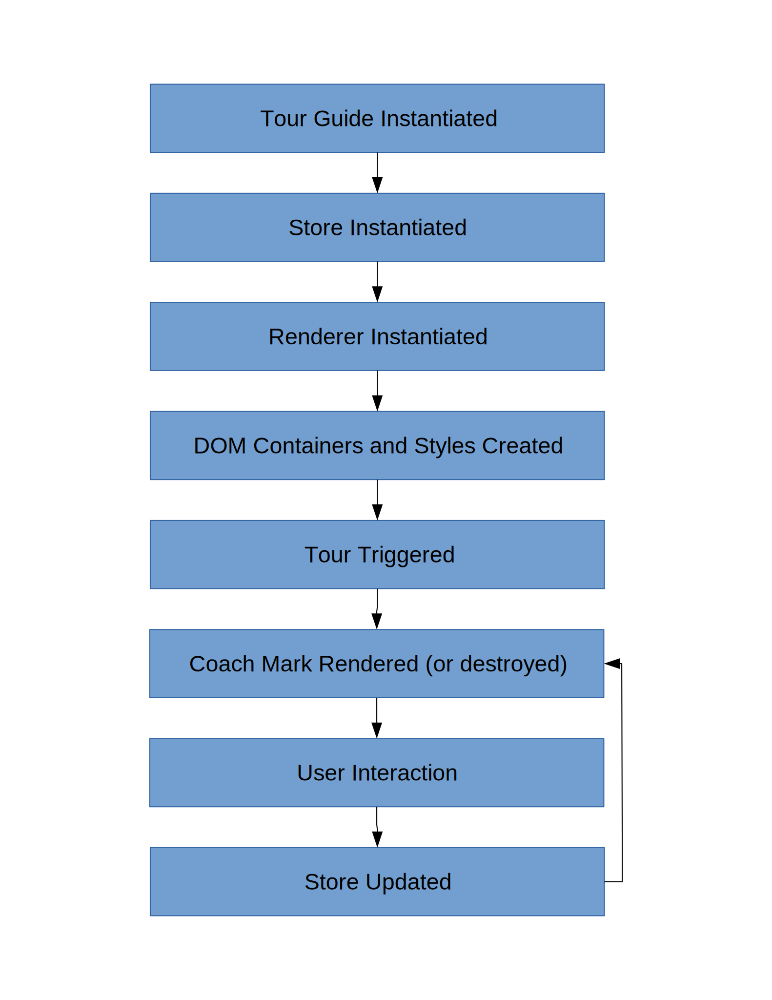

# Introduction

Tour Guide is a javaScript framework for creating in product guides and tutorials for web applications.  This is accomplished by creating "coach marks", or UI overlays that give the user detailed information about a specific UI element.  Tour Guide navigates the user through a series of coach marks, or a tour, in an effort to educate the user about a given feature or workflow.  It is hoped that this will help increase user adoption of new products and new product features.

# Deploying Tour Guide

There are currently two recommened strategies for deploying Tour Guide to your application.  The first is through the DTM.  The second is by inserting the neccessary script tags into your application's HTML.

## Through the DTM

If your application supports the DTM, you can use the DTM to deploy Tour Guide to your applicatoin.  This is by far the preffered deployment method.  Deploying through the DTM will greatly simplify the process of updating and managing tours.  For more information on how to deploy Tour Guide through the DTM please contact Kevin Smith at kevsmith@adobe.com or Grant Heath at gheath@adobe.com.

## Through Target as A/B test.

1.  Insert the following script tag into the head of your application's HTML header:
```
<script type="text/javascript" src="[path to where tour-guide.js is hosted goes here]"></script>
```
2.  Setup experience A.  Make sure experience A executes the following JavaScript:
```
window.tourGuide = new window.TourGuide(
  // tour guide configuration for experience A goes here
)
```
3.  Setup experience B.  Make sure experience B executes the following JavaScript:
```
window.tourGuide = new window.TourGuide(
  // tour guide configuration for experience B goes here
)
```

## Script Tags

If your application doesn't support the DTM you can still use Tour Guide on your site.  Take the following steps:

1.  Insert the following script tag into the head of your application's HTML header:
```
<script type="text/javascript" src="[path to where tour-guide.js is hosted goes here]"></script>
```
2. The Tour Guide library creates a global reference to the TourGuide class.  Create an instance of the TourGuide class by adding the following script tag to the body of your applications's HTML:
```
<script>
    window.tourGuide = new window.TourGuide(
        // tour guide configuration goes here
    )
</script>
```
### Tour Guide Configuration Object

The tour guide configuration is an object literal that contains all the information Tour Guide needs to run a tour.  For more information about the Tour Guide configuration, vist the <a href='#configuring-tour-guide'>Configuring Tour Guide</a> section of the documentation.

### Variations on Step Three

Step three does not need to be followed exactly.  There might be a situation where Tour Guide needs to be instantiated through another script.  As an example, a developer might want to load the Tour Guide configuration from a JSON file.

When instantiating a new instance of the TourGuide object it should be assigned to `window.tourGuide`.  This is because the authoring tool looks for instances of TourGuide on `window.tourGuide`.

## Why not NPM?

There hasn't been any effort into making Tour Guide available as an NPM module.  This is because our focus has been spent on making Tour Guide available through the DTM.  If you would like to see Tour Guide available as an NPM module please contact Grant Heath at gheath@adobe.com.

# Configuring Tour Guide

Tour Guide needs to be provided with configuration to define the tours and coachmarks of a given page.  If you are deploying through the DTM, this should be provided as a JSON file.  If your are not deploying through the DTM this configuration will be passed to a new instance of the TourGuide class as an object literal.

## Configuration Schema

The Tour Guide configuration conforms to the following schema:
```
{
  infoBoxIsVisible: boolean,
  currentCoachMarkIndex: integer,
  currentTourIndex: integer,
  tours: [
    {
      title: string,
      coachMarks: [
        {
          targetSelector: string,
          title: string,
          description: string,
          anchorPostition: "top" | "bottom" | "left" | "right",
          align: "start" | "center" | "end",
          media: {
            src: url,
            width : integer,
            height : integer
          },
          progressOnDomEvent: {
            event: string,
            targetSelector: string
          },
          navButtons: [ "back" | "next" | "close" ]
        }
      ]
    }
  ]
}
```

### root properties

| Property | Type | Rquired | Default | Description |
| --- | --- | --- | --- | --- |
| infoBoxIsVisible | boolean | no | false | Determines if Tour Guide is visible or not. |
| currentCoachMarkIndex | integer | no | 0 | The index of the currently displayed coach mark / tour step.|
| currentTourIndex | integer | no | 0 | The index of the currently displayed tour.|
| tours | array | yes | - | An array containing one or more tour objects. |

### tour object properties

| Property | Type | Rquired | Default | Description |
| --- | --- | --- | --- | --- |
| title | string | yes | - | The title of the tour.  Every tour should have a unique title. |
| coachMarks | array | yes | - | An array containing one or more coachMark objects. |

### coachMark object properties

| Property | Type | Rquired | Default | Description |
| --- | --- | --- | --- | --- |
| targetSelector | string | possibly | - | A CSS selector for the element the coach mark will target. This property is required if the "targetPosition" property is not present.|
| targetPosition | string | possibly | - | Determines the position of the coachmark on the screen.  Valid values are "top", "topRight", "right", "bottomRight", "bottom", "bottomLeft", "left", "topLeft", and "center".  This property is required if the "targetSelector" property is not present. |
| title | string | yes | - | The text for the title of the coach mark. |
| description | string | yes | - | The text that will be used for the coach mark description. |
| anchorPosition | string | no | "bottom" | Determines the position of the coach mark relative to the target element.  Valid values are "top", "bottom", "left", and "right". |
| align | string | no | "center" | Determines the alignment of the coach mark to the target element.  Valid values are "start", "center", and "end".
| media | object | no | - | A media object used for displaying images.  If absent, no image will be displayed on the coach mark.
| progressOnDomEvent | object | no | - | A progressOnDomEvent object.  Used to advance to the next coachMark when the specified dom event is triggered on the target element.  Useful for halting a tour until a user takes a needed action.
| navButtons | array | no | [ "back" \| "next" \| "close" ] | An array used to determine which navigation buttons the coach mark will display.  Valid array values are "back", "next", and "close".

### media object properties

| Property | Type | Rquired | Default | Description |
| --- | --- | --- | --- | --- |
| src | string | yes | - | The URL of the image that will be displayed.
| width | integer | yes | - | The width of the image in pixels.  Images with a width of 400px are recommended.
| height | integer | yes | - | The height of the image in pixels.

### progressOnDomEvent object properties

| Property | Type | Rquired | Default | Description |
| --- | --- | --- | --- | --- |
| event | string | yes | - | Any DOM event.
| targetSelector | string | yes | - | A CSS selector for the element where the DOM event will be triggered.

## CSS Selectors

Tour Guide uses and extended version of CSS Selectors.  Tour Guide adds several new selectors listed in the table below.

| Selector | Syntax | Description
| --- | --- | --- |
& | (css selector)&(child css selector) | Used for selecting elements with certain child elements. For example, `.some-class&p` would select an element with the `.some-class` class that has a `<p>` child element.
\| | (css selector)\|(fallback css selector) | Used for setting up fallbacks if a selector doesn't match an element on the page.  For example, `.might-not-exist\|.will-exist` would select an element with the class of `.will-exist` if there is no element that has the class `.might-not-exist`.
@ | (css selector)@(element attribute)=(regex) | Used for selecting elements that have elements with certian attribues.  For example, `p@innerText=^example text$` would select a `<p>` element that has the text `example text`.

## Authoring Tool

In the coming months a chrome extension will be available that will allow tour authors to interactivly create and edit tours.  This tool will export all the necessary configuration.  More information will follow when we are close to release.

# Triggering Tours

Once Tour Guide has been configured and deployed to your apllication, you can trigger a tour in one of several ways.  They can be triggered through the use of URL Queries, javaScript calls, or you can configure a tour to run on page load.

## URL Queries

You can trigger a tour by adding the following query string to the end of a URL `?showTour=tourId` where tourId is the index of the tour you wish to display.

## JavaScript

You can also trigger a tour by using several javaScript calls. First set the current tour `tourGuide.setCurrentTour(tourId)` where tourId is the index of the tour you wish to display.  Then dispaly Tour Guide `tourGuide.showTourGuide()`.

## On Page Load

A tour will be triggered automatically on page load if the following lines are added to your Tour Guide config:

```
infoBoxIsVisible: true,
currentTourIndex: tourId,
```

Where tourId is the index of the tour you wish to display.

# Callbacks

## Overview

You may want to respond to certain tour guide events.  For example, you might want to modify an attribute on a user profile if they finish the tour.  This can be accomplished by registering callbacks when tour guide dispatches certain events.

## Actions

| Action Type | Description |
| --- | --- |
SHOW_TOUR_GUIDE | Dispatched when a tour has started.
HIDE_TOUR_GUIDE | Dispatched when the user has clicked the 'Skip Tour' button.
TOUR_FINISHED | Dispatched when the user has clicked the 'Finish' button.
NEXT_COACHMARK | Dispatched when the user advances to the next coach mark.

## Example
```
tourGuide.addCallback('TOUR_FINISHED', () => {
  console.log('Huzzah!!!  The user finished the tour!!!')
})
```

# Application Structure

## Key Components

### Constructor

When Tour Guide is instantiated the following takes place:

1. The app store is created.
2. A renderer is instaniated.
3. The renderer creates the DOM elements Tour Guide will need to function.
4. Tour Guide is ready for a tour to be triggered.

### Store

The app store is a redux store.  The store's initial state is derived from the configuration passed to Tour Guide when it is instantiated.

### Renderer

When the renderer is instantiated the following DOM elements are created:

1. A div element is created before the end of the document's body.  The coachmarks are rendered as children of this div.
2. A style tag is created before the end of the document's head.  Dynamic styles are rendered as children of this style tag.
3. Another style tag is create before the of the document's head.  This tag is for static styles that will not be updated.

On instantiation, the renderer also subscribes to store.  When the state in the store changes the renderer is responsible for creating the neccessary attributes/properties that will be passed to the view components and style components.  When the state changes there are two render cycles that take place.  The first updates the tour guide elements that are descendents of the document's body.  The second updates the style tags responsible for coach mark placement, animations, etc.

### Action Dispatchers

When an action is dispatched it triggers an update to the application's store and in turn the Tour Guide UI gets rerendered.  Actions are typically dispatched as a result of user interaction.  For example, a user clicking on the "next" button will result in an action getting dispatched that advances the tour to the next coach mark.  Actions can also be triggered through the Tour Guide API.  A complete list of actions available through the API is available in the <a href="#actions"> actions section </a> of the API documentation.

## Application Lifecycle Diagram



# Developing For Tour Guide

To get started with developing for Tour Guide, open a terminal and execute the following commands:

1.  Make sure Node.js version 8.9.4 or newer is installed.  To check the version of Node.js you have installed run `node -v`.  For instructions on how to insall Node.js visit <a href='https://nodejs.org/'>https://nodejs.org/</a>
2.  Clone this git repo and go to the root folder of the project.
3.  Install the project dependencies by running `npm install`.
4.  Once the dependencies have been installed, launch a development server by running `npm start`.  This will run webpack and open a development sandbox at <a href='http://localhost:8080/'>http://localhost:8080/</a>

## Development Sandbox

Once you have completed the four installation steps, you should be looking at a browser window with the development sandbox loaded.  It is useful as a test bed for developing Tour Guide.  By default, no tour or coachmarks will be displayed.  Currently, you can execute a tour in one of two ways:

1. **By using URL parameters:**  If the following query string is present, a tour will be triggered `?showTour=0`.  ShowTour needs to passed a valid tour index.  The development sandbox has two tours so valid URLs are <a href='http://localhost:8080/?showTour=0'>http://localhost:8080/?showTour=0</a> and <a href='http://localhost:8080/?showTour=1'>http://localhost:8080/?showTour=1</a>.
2. **By using JavaScript calls:**  In your browsers console type `tourGuide.actions.showTourGuide()`.  By default, the first tour will be shown.  To switch tours, run the following command `tourGuide.actions.setCurrentTour(1)`.  For more information on the Tour Guide SDK and other 'TourGuide.actions' functions visit <a href='#api'> the api section</a> of this documentation.

## Editing Tour Guide Code

Edit the project code in the editor of your choice.  Once changes to the code have been saved, webpack will compile/bundle the changes.  If there are no errors in the code, the development server will reload the sandbox and the changed code will immediately be available.

Once you have changed the code, please do the following before creating a pull request:

1. Run ES Lint.  From a terminal in the project root run `npm run lint`.  Address any errors listed.
2. Run unit tests.  **Ok a test framework is not setup yet.  The project is still very young.  Expect either Jest or Mocha to be up and running in the next sprint.  In the future, unit tests will be essential to our development process.**

## Dependencies

Because Tour Guide was designed to be deployed through the DTM, its dependencies can't be a part of the main application bundle.  Because of this, it is important to keep the file size of the Tour Guide library as small as possible.  So, the number of dependencies used by Tour Guide has been kept to a minimum.  With that said, there are two core dependencies that Tour Guide relies on heavily:

- **<a href='https://mithril.js.org'>Mithril</a>** - A lean UI framework very similar to React.  It was used instead of React primarily because it has small file size of only 8kb while still being a very capable framework.
- **<a href='https://redux.js.org'>Redux</a>** - Redux has a tiny file size of only 2kb.  It is a state container used for building javaScript applications that adhere to the <a href='https://redux.js.org/basics/data-flow'>unidirectional data flow</a> design pattern.

## Feedback, Questions, and Concerns

If you have any feedback or are having problems getting the project up and running, please contact Grant Heath at gheath@adobe.com.

# API

## actions

* [actions](#module_actions)
    * _static_
        * [.addCoachMark](#module_actions.addCoachMark) ⇒ <code>Action</code>
        * [.nextCoachMark](#module_actions.nextCoachMark) ⇒ <code>Action</code>
        * [.prevCoachMark](#module_actions.prevCoachMark) ⇒ <code>Action</code>
        * [.setCurrentCoachMark](#module_actions.setCurrentCoachMark) ⇒ <code>Action</code>
        * [.nextTour](#module_actions.nextTour) ⇒ <code>Action</code>
        * [.prevTour](#module_actions.prevTour) ⇒ <code>Action</code>
        * [.setCurrentTour](#module_actions.setCurrentTour) ⇒ <code>Action</code>
        * [.hideTourGuide](#module_actions.hideTourGuide) ⇒ <code>Action</code>
        * [.showTourGuide](#module_actions.showTourGuide) ⇒ <code>Action</code>
        * [.hideMore](#module_actions.hideMore) ⇒ <code>Action</code>
        * [.showMore](#module_actions.showMore) ⇒ <code>Action</code>
        * [.modifyCoachMarkAttributes](#module_actions.modifyCoachMarkAttributes)
    * _inner_
        * [~CoachMarkMedia](#module_actions..CoachMarkMedia) : <code>Object</code>
        * [~CoachMarkProperties](#module_actions..CoachMarkProperties) : <code>Object</code>
        * [~Action](#module_actions..Action) : <code>Object</code>

<a name="module_actions.addCoachMark"></a>

### actions.addCoachMark ⇒ <code>Action</code>
This action adds a new coach mark to the tour.
The new coach mark will be appeneded to the end of the tour.

**Kind**: static constant of [<code>actions</code>](#module_actions)
**Returns**: <code>Action</code> - - The addCoachMark action that was just crated.

| Param | Type | Description |
| --- | --- | --- |
| properties | <code>CoachMarkProperties</code> | An object that defines the coach mark properties. |
| [tourId] | <code>number</code> | An integer, the index of the tour that the coach mark will be added to. |

<a name="module_actions.nextCoachMark"></a>

### actions.nextCoachMark ⇒ <code>Action</code>
This triggers the next coach mark.
If the current coach mark is the last coach mark in the tour,
the tour will proceed at the first coach mark.

**Kind**: static constant of [<code>actions</code>](#module_actions)
<a name="module_actions.prevCoachMark"></a>

### actions.prevCoachMark ⇒ <code>Action</code>
This action triggers the previous coach mark.
If the current coach mark is the first coach mark in the tour,
the tour will proceed at the last coach mark.

**Kind**: static constant of [<code>actions</code>](#module_actions)
<a name="module_actions.setCurrentCoachMark"></a>

### actions.setCurrentCoachMark ⇒ <code>Action</code>
This action triggers the specified coach mark.
The provided coach mark id must be valid or an error will be thrown.

**Kind**: static constant of [<code>actions</code>](#module_actions)

| Param | Type | Description |
| --- | --- | --- |
| id | <code>Number</code> | An integer specifying the index of the coach mark that will be made current. |

<a name="module_actions.nextTour"></a>

### actions.nextTour ⇒ <code>Action</code>
This action triggers the next available tour.
The next tour will start at the first coach mark.

**Kind**: static constant of [<code>actions</code>](#module_actions)
<a name="module_actions.prevTour"></a>

### actions.prevTour ⇒ <code>Action</code>
This action triggers the previous tour.
The tour will start at the first coach mark.

**Kind**: static constant of [<code>actions</code>](#module_actions)
<a name="module_actions.setCurrentTour"></a>

### actions.setCurrentTour ⇒ <code>Action</code>
This action activates the specified tour.
The tour will start at the first coach mark.
The provided tour id must be valid or an error will be thrown.

**Kind**: static constant of [<code>actions</code>](#module_actions)

| Param | Type | Description |
| --- | --- | --- |
| id | <code>number</code> | An integer specifying the index of the tour that will be made active. |

<a name="module_actions.hideTourGuide"></a>

### actions.hideTourGuide ⇒ <code>Action</code>
This action hides the tour guide UI.
If the UI is already hidden, nothing will happen.

**Kind**: static constant of [<code>actions</code>](#module_actions)
<a name="module_actions.showTourGuide"></a>

### actions.showTourGuide ⇒ <code>Action</code>
This action shows the tour guide UI.
If the UI is already visible, nothing will happen.

**Kind**: static constant of [<code>actions</code>](#module_actions)
<a name="module_actions.hideMore"></a>

### actions.hideMore ⇒ <code>Action</code>
This action hides the tour guide navigation menu.
If the menu is already hidden, nothing wil happen.

**Kind**: static constant of [<code>actions</code>](#module_actions)
<a name="module_actions.showMore"></a>

### actions.showMore ⇒ <code>Action</code>
This action shows the tour guide navigation menu.
If the menu is already visible, nothing will happen.

**Kind**: static constant of [<code>actions</code>](#module_actions)
<a name="module_actions.modifyCoachMarkAttributes"></a>

### actions.modifyCoachMarkAttributes
This action modifies the attributes of an exisiting coach mark.

**Kind**: static constant of [<code>actions</code>](#module_actions)

| Param | Type | Description |
| --- | --- | --- |
| attributes | <code>CoachMarkProperties</code> | The attributes to be altered. |
| coachmarkId | <code>number</code> | An integer specifying the index of the coachmark to be altered. If not provided, the current coach mark will be used. |
| tourId | <code>\*</code> | An integer specifying the index of the tour containing the coach mark that will be altered. If not provided, the current tour will be used. |

<a name="module_actions..CoachMarkMedia"></a>

### actions~CoachMarkMedia : <code>Object</code>
**Kind**: inner typedef of [<code>actions</code>](#module_actions)
**Properties**

| Name | Type | Description |
| --- | --- | --- |
| src | <code>string</code> | The url to the coach mark's media file. |
| width | <code>number</code> | The width of the media in pixels. |
| height | <code>number</code> | The height of the media in pixels. |

<a name="module_actions..CoachMarkProperties"></a>

### actions~CoachMarkProperties : <code>Object</code>
A plain javaScript object that specificies the properties of a coach mark.

**Kind**: inner typedef of [<code>actions</code>](#module_actions)
**Properties**

| Name | Type | Description |
| --- | --- | --- |
| title | <code>string</code> \| <code>undefined</code> | The coach mark's title. |
| description | <code>string</code> \| <code>undefined</code> | The coach mark's description. |
| anchorPosition | <code>string</code> \| <code>undefined</code> | The coach mark's anchor position. |
| align | <code>string</code> \| <code>undefined</code> | The alignment of the coach mark. |
| media | <code>CoachMarkMedia</code> \| <code>undefined</code> | The coachmark's media. |

<a name="module_actions..Action"></a>

### actions~Action : <code>Object</code>
A flux standard action

**Kind**: inner typedef of [<code>actions</code>](#module_actions)
**Properties**

| Name | Type | Description |
| --- | --- | --- |
| type | <code>string</code> | The action's type. |
| payload | <code>\*</code> | The action's payload. |
